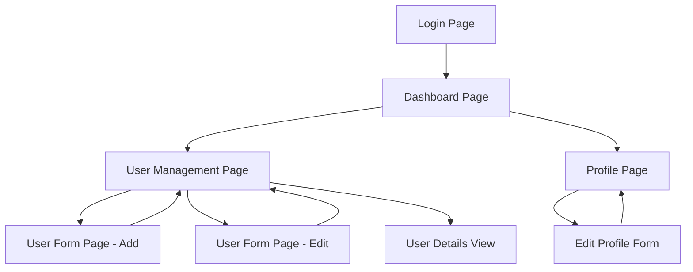

# ATA IT Frontend Assignment 2024 - Product Requirements Document

## 1. Product Overview

A comprehensive React-based user management dashboard that demonstrates modern frontend development skills including component composition, state management, API integration, and responsive design. The application serves as a practical assessment tool for evaluating React development capabilities in a real-world scenario.

## 2. Core Features

### 2.1 User Roles

| Role | Registration Method | Core Permissions |
|------|---------------------|------------------|
| Admin User | Direct login with credentials | Full CRUD operations on users, access to dashboard analytics |
| Regular User | View-only access | Can view user listings and basic dashboard information |

### 2.2 Feature Module

Our user management application consists of the following main pages:

1. **Login Page**: authentication form, error handling, redirect logic
2. **Dashboard Page**: user statistics, data visualization charts, quick actions panel
3. **User Management Page**: user listing table, search and filter controls, pagination
4. **User Form Page**: add/edit user forms, validation, success/error feedback
5. **Profile Page**: user profile display, edit profile functionality

### 2.3 Page Details

| Page Name | Module Name | Feature description |
|-----------|-------------|---------------------|
| Login Page | Authentication Form | Validate user credentials, handle login errors, redirect to dashboard on success |
| Login Page | Session Management | Maintain user session, auto-logout on expiry, remember login state |
| Dashboard Page | Statistics Overview | Display total users count, active users, recent registrations with visual charts |
| Dashboard Page | Quick Actions | Provide shortcuts to add new user, export data, refresh statistics |
| Dashboard Page | Recent Activity | Show latest user activities, system notifications, alerts panel |
| User Management Page | User Listing | Display paginated user table with sorting, search by name/email, filter by status |
| User Management Page | Bulk Operations | Select multiple users, bulk delete, bulk status update, export selected |
| User Management Page | User Actions | Individual user edit, delete, view details, activate/deactivate |
| User Form Page | Add User Form | Create new user with validation, required fields, email uniqueness check |
| User Form Page | Edit User Form | Update existing user data, preserve original values, confirm changes |
| User Form Page | Form Validation | Real-time validation, error messages, success feedback, form reset |
| Profile Page | User Profile Display | Show current user information, avatar, contact details, role information |
| Profile Page | Profile Edit | Allow users to update their own profile, password change, avatar upload |

## 3. Core Process

**Admin User Flow:**
The admin logs in through the authentication form and is redirected to the dashboard where they can view user statistics and recent activities. From the dashboard, they can navigate to the user management page to view all users in a paginated table with search and filter capabilities. The admin can add new users through the user form page or edit existing users. They can also perform bulk operations like deleting multiple users or updating their status. The admin can access their own profile page to update personal information.

**Regular User Flow:**
Regular users log in and access a limited dashboard view with basic statistics. They can browse the user listing in read-only mode and view their own profile page to update personal information. They cannot perform administrative actions like adding, editing, or deleting other users.

## 4. User Interface Design

### 4.1 Design Style

- **Primary Colors**: Blue (#2563eb) for primary actions, Gray (#6b7280) for secondary elements
- **Secondary Colors**: Green (#10b981) for success states, Red (#ef4444) for errors, Yellow (#f59e0b) for warnings
- **Button Style**: Rounded corners (8px), solid backgrounds for primary actions, outlined for secondary
- **Font**: Inter font family, 14px base size, 16px for headings, 12px for captions
- **Layout Style**: Card-based design with subtle shadows, clean grid layouts, consistent spacing (16px, 24px, 32px)
- **Icons**: Heroicons for consistent iconography, 20px standard size, 16px for inline icons

### 4.2 Page Design Overview

| Page Name | Module Name | UI Elements |
|-----------|-------------|-------------|
| Login Page | Authentication Form | Centered card layout, branded header, input fields with floating labels, primary CTA button, error alert banner |
| Dashboard Page | Statistics Cards | Grid layout with metric cards, blue accent colors, chart visualizations using Chart.js, responsive 3-column to 1-column |
| Dashboard Page | Quick Actions | Horizontal button group, icon + text labels, hover states with subtle animations |
| User Management Page | Data Table | Striped table rows, sortable headers, search input with magnifying glass icon, pagination controls |
| User Management Page | Filter Controls | Dropdown selects, checkbox groups, clear filters button, applied filters as removable tags |
| User Form Page | Form Layout | Two-column form on desktop, single column on mobile, grouped sections, validation error styling |
| Profile Page | Profile Header | Avatar circle, user name and role, edit button, card-based information sections |

### 4.3 Responsiveness

The application follows a mobile-first responsive design approach with breakpoints at 640px (sm), 768px (md), 1024px (lg), and 1280px (xl). Touch interactions are optimized for mobile devices with appropriate button sizes (minimum 44px) and touch-friendly spacing. The layout adapts from multi-column desktop views to single-column mobile layouts with collapsible navigation and optimized form inputs for mobile keyboards.