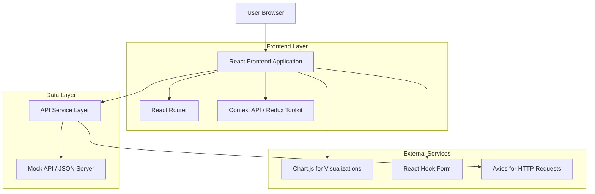
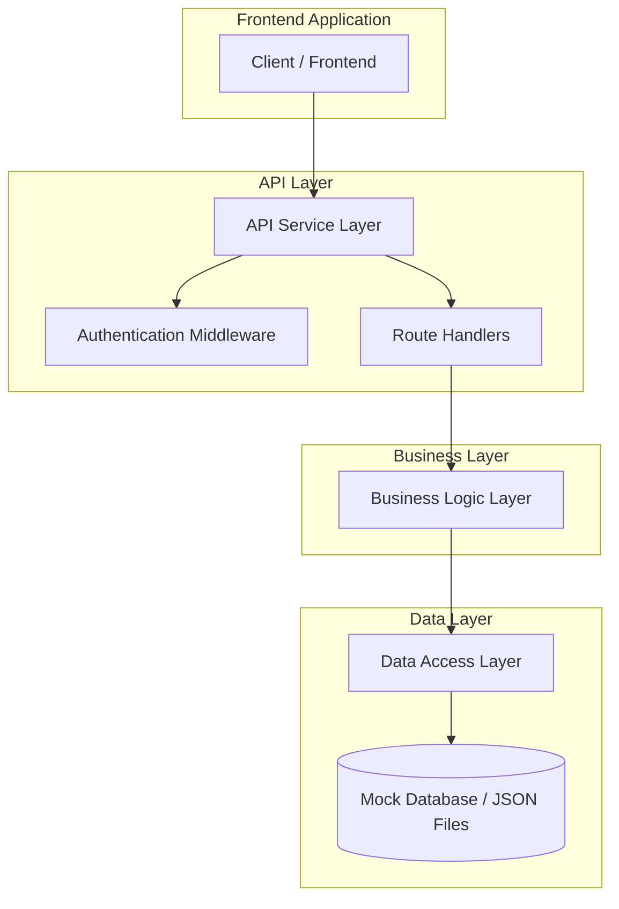
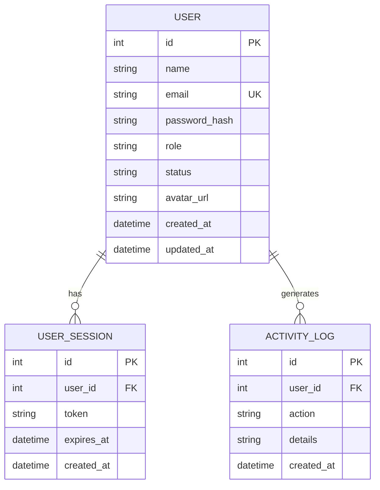

# ATA IT Frontend Assignment 2024 - Technical Architecture Document

## 1. Architecture Design



## 2. Technology Description

- Frontend: React@18 + TypeScript@5 + Vite@5 + TailwindCSS@3
- State Management: Context API + useReducer / Redux Toolkit@2
- Routing: React Router@6
- HTTP Client: Axios@1
- Form Handling: React Hook Form@7
- Data Visualization: Chart.js@4 + react-chartjs-2@5
- Testing: Jest@29 + React Testing Library@14 + Vitest@1
- Package Manager: pnpm@8

## 3. Route Definitions

| Route | Purpose |
|-------|---------|
| /login | Authentication page for user login |
| / | Dashboard home page with statistics and overview |
| /users | User management page with listing and search |
| /users/add | Add new user form page |
| /users/:id/edit | Edit existing user form page |
| /users/:id | User detail view page |
| /profile | Current user profile page |
| /profile/edit | Edit current user profile page |

## 4. API Definitions

### 4.1 Core API

**Authentication Endpoints**

```
POST /api/auth/login
```

Request:
| Param Name | Param Type | isRequired | Description |
|------------|------------|------------|-------------|
| email | string | true | User email address |
| password | string | true | User password |

Response:
| Param Name | Param Type | Description |
|------------|------------|-------------|
| success | boolean | Login success status |
| token | string | JWT authentication token |
| user | object | User profile information |

Example Request:
```json
{
  "email": "admin@example.com",
  "password": "password123"
}
```

Example Response:
```json
{
  "success": true,
  "token": "eyJhbGciOiJIUzI1NiIsInR5cCI6IkpXVCJ9...",
  "user": {
    "id": 1,
    "name": "Admin User",
    "email": "admin@example.com",
    "role": "admin"
  }
}
```

**User Management Endpoints**

```
GET /api/users
```

Query Parameters:
| Param Name | Param Type | isRequired | Description |
|------------|------------|------------|-------------|
| page | number | false | Page number for pagination (default: 1) |
| limit | number | false | Items per page (default: 10) |
| search | string | false | Search term for name/email |
| status | string | false | Filter by user status (active/inactive) |

Response:
| Param Name | Param Type | Description |
|------------|------------|-------------|
| users | array | Array of user objects |
| total | number | Total number of users |
| page | number | Current page number |
| totalPages | number | Total number of pages |

```
POST /api/users
```

Request:
| Param Name | Param Type | isRequired | Description |
|------------|------------|------------|-------------|
| name | string | true | User full name |
| email | string | true | User email address |
| role | string | true | User role (admin/user) |
| status | string | false | User status (default: active) |

```
PUT /api/users/:id
```

Request:
| Param Name | Param Type | isRequired | Description |
|------------|------------|------------|-------------|
| name | string | false | Updated user name |
| email | string | false | Updated email address |
| role | string | false | Updated user role |
| status | string | false | Updated user status |

```
DELETE /api/users/:id
```

Response:
| Param Name | Param Type | Description |
|------------|------------|-------------|
| success | boolean | Deletion success status |
| message | string | Success/error message |

**Dashboard Statistics Endpoints**

```
GET /api/dashboard/stats
```

Response:
| Param Name | Param Type | Description |
|------------|------------|-------------|
| totalUsers | number | Total number of users |
| activeUsers | number | Number of active users |
| newUsersThisMonth | number | Users registered this month |
| userGrowthData | array | Monthly user growth data for charts |

## 5. Server Architecture Diagram



## 6. Data Model

### 6.1 Data Model Definition



### 6.2 Data Definition Language

**User Table (users)**
```sql
-- Create users table
CREATE TABLE users (
    id INTEGER PRIMARY KEY AUTOINCREMENT,
    name VARCHAR(100) NOT NULL,
    email VARCHAR(255) UNIQUE NOT NULL,
    password_hash VARCHAR(255) NOT NULL,
    role VARCHAR(20) DEFAULT 'user' CHECK (role IN ('admin', 'user')),
    status VARCHAR(20) DEFAULT 'active' CHECK (status IN ('active', 'inactive')),
    avatar_url VARCHAR(500),
    created_at DATETIME DEFAULT CURRENT_TIMESTAMP,
    updated_at DATETIME DEFAULT CURRENT_TIMESTAMP
);

-- Create indexes
CREATE INDEX idx_users_email ON users(email);
CREATE INDEX idx_users_role ON users(role);
CREATE INDEX idx_users_status ON users(status);
CREATE INDEX idx_users_created_at ON users(created_at DESC);

-- Insert initial data
INSERT INTO users (name, email, password_hash, role, status) VALUES
('Admin User', 'admin@example.com', '$2b$10$hash...', 'admin', 'active'),
('John Doe', 'john@example.com', '$2b$10$hash...', 'user', 'active'),
('Jane Smith', 'jane@example.com', '$2b$10$hash...', 'user', 'active'),
('Bob Wilson', 'bob@example.com', '$2b$10$hash...', 'user', 'inactive');
```

**User Sessions Table (user_sessions)**
```sql
-- Create user sessions table
CREATE TABLE user_sessions (
    id INTEGER PRIMARY KEY AUTOINCREMENT,
    user_id INTEGER NOT NULL,
    token VARCHAR(500) NOT NULL,
    expires_at DATETIME NOT NULL,
    created_at DATETIME DEFAULT CURRENT_TIMESTAMP,
    FOREIGN KEY (user_id) REFERENCES users(id) ON DELETE CASCADE
);

-- Create indexes
CREATE INDEX idx_sessions_token ON user_sessions(token);
CREATE INDEX idx_sessions_user_id ON user_sessions(user_id);
CREATE INDEX idx_sessions_expires_at ON user_sessions(expires_at);
```

**Activity Log Table (activity_logs)**
```sql
-- Create activity logs table
CREATE TABLE activity_logs (
    id INTEGER PRIMARY KEY AUTOINCREMENT,
    user_id INTEGER,
    action VARCHAR(100) NOT NULL,
    details TEXT,
    created_at DATETIME DEFAULT CURRENT_TIMESTAMP,
    FOREIGN KEY (user_id) REFERENCES users(id) ON DELETE SET NULL
);

-- Create indexes
CREATE INDEX idx_activity_user_id ON activity_logs(user_id);
CREATE INDEX idx_activity_created_at ON activity_logs(created_at DESC);
CREATE INDEX idx_activity_action ON activity_logs(action);
```