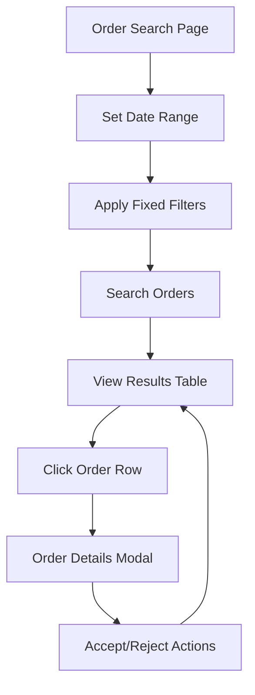

# Order Search and Management Application - Product Requirements Document

## 1. Product Overview
A ReactJS web application that enables users to search and view financial orders with comprehensive filtering capabilities and responsive design. The application provides an intuitive interface for traders and financial professionals to manage and monitor their order transactions efficiently.

The system addresses the need for real-time order tracking and management in financial trading environments, allowing users to quickly locate specific orders within date ranges and view detailed order information across different devices.

## 2. Core Features

### 2.1 User Roles
| Role | Registration Method | Core Permissions |
|------|---------------------|------------------|
| Trader | Direct access (no registration required) | Can search, view, and filter orders |
| Admin | System access | Can view all orders and manage system settings |

### 2.2 Feature Module
Our order management application consists of the following main pages:
1. **Order Search Page**: Search filters, date range selection, order results table
2. **Order Details Modal**: Detailed order information, transaction history, order actions

### 2.3 Page Details
| Page Name | Module Name | Feature description |
|-----------|-------------|---------------------|
| Order Search Page | Search Filters | Implement date range picker with start/end dates, fixed Period filter (Transmission), fixed Status filter (Waiting) |
| Order Search Page | Results Table | Display comprehensive order data with responsive columns, sorting, pagination |
| Order Search Page | Mobile View | Show condensed view with 4 key columns: Account, Operation, Symbol, Status |
| Order Details Modal | Order Information | Display complete order details including warnings, reference numbers, exchange rates |
| Order Details Modal | Action Buttons | Provide Accept/Reject functionality with confirmation dialogs |

## 3. Core Process
**Main User Flow:**
1. User accesses the order search page
2. User selects date range using date pickers (Starting Date and Ending Date)
3. System automatically applies fixed filters (Period: Transmission, Status: Waiting)
4. User clicks Search button to retrieve filtered results
5. System displays orders in responsive table format
6. User can click on any order row to view detailed information
7. User can perform actions (Accept/Reject) on individual orders

## 4. User Interface Design

### 4.1 Design Style
- **Primary Colors**: Blue (#3B82F6) for primary actions, Gray (#6B7280) for secondary elements
- **Secondary Colors**: Green (#10B981) for success states, Red (#EF4444) for warnings/rejections
- **Button Style**: Rounded corners with subtle shadows, modern flat design
- **Font**: Inter or system fonts, 14px base size, 16px for headers
- **Layout Style**: Clean table-based layout with card-style modals, top navigation with search filters
- **Icons**: Feather icons or Heroicons for consistent modern appearance

### 4.2 Page Design Overview
| Page Name | Module Name | UI Elements |
|-----------|-------------|-------------|
| Order Search Page | Search Filters | Horizontal filter bar with date pickers, dropdown selectors, blue search button |
| Order Search Page | Results Table | Clean white table with alternating row colors, sortable headers, responsive breakpoints |
| Order Search Page | Mobile View | Compact card-style layout showing essential information, touch-friendly interactions |
| Order Details Modal | Order Information | Modal overlay with detailed information grid, warning alerts in yellow/orange |
| Order Details Modal | Action Buttons | Primary blue Accept button, secondary red Reject button with confirmation |

### 4.3 Responsiveness
The application is desktop-first with mobile-adaptive design. On screens ≤768px, the table transforms to show only 4 essential columns (Account, Operation, Symbol, Status) with touch-optimized interactions for better mobile usability.