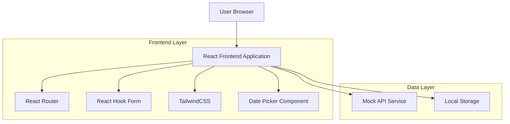
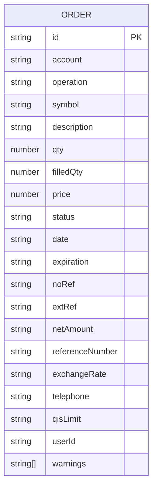

# Order Search and Management Application - Technical Architecture Document

## 1. Architecture Design



## 2. Technology Description
- Frontend: React@18 + TypeScript + TailwindCSS + Vite
- Form Management: React Hook Form + Zod validation
- Date Handling: React DatePicker or similar date component
- State Management: React useState/useReducer (no external state library needed)
- Data Storage: Mock API service with localStorage persistence

## 3. Route Definitions
| Route | Purpose |
|-------|---------|
| / | Main order search page with filters and results table |
| /orders/:id | Individual order details view (optional modal alternative) |

## 4. API Definitions

### 4.1 Core API

Order search and retrieval
```
GET /api/orders
```

Request:
| Param Name | Param Type | isRequired | Description |
|------------|------------|------------|-------------|
| startDate | string (ISO date) | true | Starting date for order search |
| endDate | string (ISO date) | true | Ending date for order search |
| period | string | false | Fixed value: 'Transmission' |
| status | string | false | Fixed value: 'Waiting' |

Response:
| Param Name | Param Type | Description |
|------------|------------|-------------|
| orders | Order[] | Array of order objects |
| total | number | Total number of orders found |
| page | number | Current page number |

Example Response:
```json
{
  "orders": [
    {
      "id": "10000000",
      "account": "10000000",
      "operation": "Buy",
      "symbol": "NA",
      "description": "NATIONAL BANK OF CDA",
      "qty": 11,
      "filledQty": 1,
      "price": 135.00,
      "status": "Waiting",
      "date": "2022/12/22 03:02:14",
      "expiration": "2022/12/22 03:02:14",
      "noRef": "95749207",
      "extRef": "2-XXXXXXX1-0",
      "netAmount": "1,152.95 USD",
      "referenceNumber": "1234567890",
      "exchangeRate": "1.3357",
      "telephone": "000-000-0000",
      "qisLimit": "140.0",
      "userId": "12344321",
      "warnings": [
        "To trade this security in this account, a currency conversion will be made at the current rate.",
        "A similar order has already been submitted.",
        "Your transaction will be processed the following business day.",
        "It is not possible to calculate the buying power of this order.",
        "A cancellation will not be possible during business hours on market orders. You can call a representative for more information.",
        "For the above-mentioned reason(s), your order will be processed by one of our representatives."
      ]
    }
  ],
  "total": 123,
  "page": 1
}
```

## 5. Data Model

### 5.1 Data Model Definition


### 5.2 Data Definition Language
TypeScript Interface Definitions:

```typescript
interface Order {
  id: string;
  account: string;
  operation: 'Buy' | 'Sell';
  symbol: string;
  description: string;
  qty: number;
  filledQty: number;
  price: number;
  status: 'Waiting' | 'Filled' | 'Cancelled' | 'Rejected';
  date: string;
  expiration: string;
  noRef: string;
  extRef: string;
  netAmount: string;
  referenceNumber: string;
  exchangeRate: string;
  telephone: string;
  qisLimit: string;
  userId: string;
  warnings: string[];
}

interface SearchFilters {
  startDate: string;
  endDate: string;
  period: 'Transmission';
  status: 'Waiting';
}

interface OrderSearchResponse {
  orders: Order[];
  total: number;
  page: number;
}
```

Mock Data Structure:
```typescript
const mockOrders: Order[] = [
  {
    id: "10000000",
    account: "10000000",
    operation: "Buy",
    symbol: "NA",
    description: "NATIONAL BANK OF CDA",
    qty: 11,
    filledQty: 1,
    price: 135.00,
    status: "Waiting",
    date: "2022/12/22 03:02:14",
    expiration: "2022/12/22 03:02:14",
    noRef: "95749207",
    extRef: "2-XXXXXXX1-0",
    netAmount: "1,152.95 USD",
    referenceNumber: "1234567890",
    exchangeRate: "1.3357",
    telephone: "000-000-0000",
    qisLimit: "140.0",
    userId: "12344321",
    warnings: [
      "To trade this security in this account, a currency conversion will be made at the current rate.",
      "A similar order has already been submitted.",
      "Your transaction will be processed the following business day.",
      "It is not possible to calculate the buying power of this order.",
      "A cancellation will not be possible during business hours on market orders. You can call a representative for more information.",
      "For the above-mentioned reason(s), your order will be processed by one of our representatives."
    ]
  }
  // ... additional mock orders
];
```